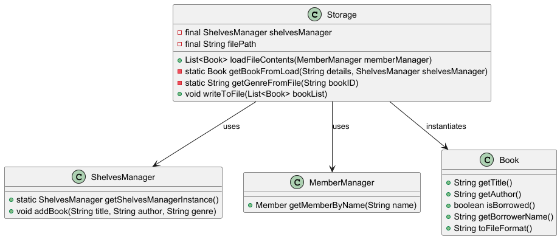

# Developer Guide

## Acknowledgements

LeBook uses the following libraries:
1. [JUnit](https://junit.org/junit5/) - For writing and executing automated tests
2. [Gradle](https://gradle.org/) - A build automation tool

## Design & implementation

### Parser component
**API:** [`Parser.java`](https://github.com/AY2425S2-CS2113-T13-3/tp/blob/master/src/main/java/seedu/duke/parser/Parser.java)
The parser component is responsible for interpreting user input and calling the appropriate command object.
It takes a string input from the user, determines the corresponding command type, and returns an instance of a subclass of Command.

How the parser component works:
1. Extracts the command keyword from the user input.
2. Matches the keyword to the relevant commands.
3. Extracts the remaining arguments (if any).
4. Returns a corresponding Command object for execution.

### Storage Class
**API:** [`Storage.java`](https://github.com/AY2425S2-CS2113-T13-3/tp/blob/master/src/main/java/seedu/duke/storage/Storage.java)
1. **Overview**
   - The `Storage` class in LeBook is responsible for saving the data after the user exits `LeBook`. To load the data when the user launches `LeBook`, it reads data from a file and loads it into a list. When exiting the program, it writes the Books back into the file in a specific format.
2. **Design**
   - Each `Book` is stored in structured text using a `|` delimiter.
   - Each time the user exits the program, the file is overwritten, ensuring that the content is up to date.
   - If the file to save the data does not exist, an empty list is returned. Exceptions are caught and logged.

### Command Class

1. Command Class Design:

   - All commands extend the Command class, which is abstract and defines the execute() method.
   - The execute() method in each command class contains the logic to perform a specific action.
   - Each command interacts with BookManager (to manage books), Ui (to print messages), and Storage (to save data to a file).

2. Commands Enum (Commands.java):

   - The Commands enum defines all possible commands, like ADD, DELETE, LIST, BORROW, RETURN, etc.
   - The enum makes it easier to map user input to the correct command type.

## Appendix
### Product scope

LeBook is a comprehensive library management system that allows librarians to easily catalogue borrowed and returned 
books, streamlining inventory management and tracking book availabilities.

### Target user profile

Library staff who wish to efficiently manage book collections

### Value proposition

Enables efficient cataloging, borrowing, and returning of books through a command-line interface, allowing librarians 
to manage inventory and track book availability quickly compared to a typical mouse/GUI driven app

## User Stories

| Version | As a ...  | I want to ...                                 | So that I can ...                                                                                         |
|---------|-----------|-----------------------------------------------|-----------------------------------------------------------------------------------------------------------|
| v1.0    | librarian | add new books to the system                   | keep track of the new arrivals.                                                                           |
| v1.0    | librarian | delete a book                                 | remove outdated or lost books.                                                                            |
| v1.0    | librarian | see the list of all my books                  | see what books I have in the library.                                                                     |
| v1.0    | librarian | record when people borrow a book              | keep track when a book is borrowed.                                                                       |
| v1.0    | librarian | record when people return a book              | update its availability.                                                                                  |
| v1.0    | librarian | set due dates for my books                    | so that I can monitor when books will be returned and keep track of books that have yet to been returned. |
| v1.0    | librarian | save the book details                         | keep track of book statuses when using the system again.                                                  |
| v1.0    | librarian | enter the command as one long string          | enter the input without caring about different parts of the input.                                        |
| v1.0    | librarian | see what happens whenever I perform a command | confirm that my inputs have been added correctly.                                                         |
| v2.0    | librarian | view the list of all available commands       | know what commands are available in the system.                                                           |
| v2.0    | librarian | know the genre of a book                      | better organise the catalogue.                                                                            |
| v2.0    | librarian | keep track of what shelf a book is on         | easily locate the book.                                                                                   |
| v2.0    | librarian | view the catalogue of a specific shelf        | view available/missing/borrowed books on the shelf.                                                       |
| v2.0    | librarian | view a list of overdue books                  | follow up with contacting the appropriate user.                                                           |
| v2.0    | librarian | search for a book through keywords            | find the appropriate book.                                                                                |
| v2.0    | librarian | see the overall statistics of the library     | know the total number of books, overdue books and borrowed books.                                         |
| v2.0    | librarian | undo the last command                         | correct my actions if it was a wrong commnd                                                               |

## Non-Functional Requirements

1. Should work on any mainstream OS that has installed Java 17 or above.
2. Built to support only a single user.

## Glossary

* *glossary item* - Definition

## Instructions for manual testing

### Initial Launch

1. Download the LeBook JAR file and copy it into an empty folder.
2. Start the application by using java -jar LeBook.jar in the terminal.

### Adding a book
Adding a book while the library is empty

1. Prerequisites: List all books using the `list` command. No books in the list.

2. Test case: `add The Great Gatsby / F. Scott Fitzgerald`
   - Expected: Book is added to the library. Details of the added book shown in the status message. Library now contains 1 book.

3. Test case: `add` (without title and author)
   - Expected: No book is added. Error details shown in the status message. Library remains empty.

4. Other incorrect add commands to try: `add TITLE`, `add / AUTHOR`, `add TITLE /` (without author)
   - Expected: Similar to previous.

### Deleting a book
Deleting a book while multiple books are listed

1. Prerequisites: List all books using the `list` command. Multiple books in the list.

2. Test case: `delete 1`
   - Expected: First book is deleted from the list. Details of the deleted book shown in the status message. Library now contains fewer books.

3. Test case: `delete 0`
   - Expected: No book is deleted. Error details shown in the status message. Library remains unchanged.

4. Other incorrect delete commands to try: `delete`, `delete x` (where x is larger than the list size)
   - Expected: Similar to previous.

### Listing books
Listing books when the library is empty and when it contains multiple books

1. Prerequisites: List all books using the `list` command. Initially, no books in the list.

2. Test case: `list` (with no books)
   - Expected: Message indicating that the library is empty.

3. Test case: `list` (after adding multiple books)
   - Expected: List displays all books with their status and details.

### Borrowing a book
Borrowing a book when it is available

1. Prerequisites: List all books using the `list` command. At least one available book in the list.

2. Test case: `borrow 1`
   - Expected: Book is marked as borrowed. Status message indicates that the book has been borrowed. Book status changes to `[X]`.
   - Return due date is set to 2 weeks from the date of borrowing.

3. Test case: `borrow 0`
   - Expected: No book is borrowed. Error details shown in the status message. Book status remains unchanged.

4. Other incorrect borrow commands to try: `borrow`, `borrow x` (where x is larger than the list size or the book is already borrowed)
   - Expected: Similar to previous.

### Returning a book
Returning a borrowed book

1. Prerequisites: List all books using the `list` command. At least one borrowed book in the list.

2. Test case: `return 1`
   - Expected: Book is marked as returned. Status message indicates that the book has been returned. Book status changes to `[ ]`.
   - Return due date is reset and set to `null`.

3. Test case: `return 0`
   - Expected: No book is returned. Error details shown in the status message. Book status remains unchanged.

4. Other incorrect return commands to try: `return`, `return x` (where x is larger than the list size or the book is not borrowed)
   - Expected: Similar to previous.

### Listing overdue books
Listing books whose return due date has been surpassed by the current date

1. Prerequisites: List all overdue books using the `list overdue` command. Initially, no books are overdue.

2. Test case: `list overdue` (with no overdue books)
   - Expected: Message indicating that there are currently no overdue books.

3. Test case: `list overdue` (after multiple books have surpassed overdue date)
   - Expected: List displays all overdue books with their status and details.

### Exiting the application
Exiting the application

1. Prerequisites: Application is running.

2. Test case: `exit`
   - Expected: Application closes with a goodbye message.

### BookManager Class

1. Introduction
   Responsible for managing the library's book collection. 

2. Design and Implementation
   Designed following Single Responsibility Principle
   The addNewBook() method allows users to add a new book to the library with a specified title and author. 
   The method enforces proper formatting and validation rules.

3. Future enhancements
   A planned enhancement is to add search functionality to the BookManager, allowing users to find books by title, author, or keywords.

### User Interface Class

1. Introduction
   The `Ui` class in LeBook handles all interactions with the user. It is responsible for reading inputs and printing outputs including welcome messages, command results and error messages.
   This class abstracts all system input/output logic to maintain separation of concerns in application.

2. Design and Implementation
   `Ui` class encapsulates a `Scanner` object to read inputs from `System.in`
   The `readCommand()` method prompts users for inputs and returns trimmed string for parsing.
   All output messages are standardized using `printWithSeparator(String message)`, which adds visual separators `=====` above and below messages for better readability.

3. Future enhancements
   Potentially add support for multi-lined inputs

### Handling missing/corrupted data files

To simulate a missing or corrupted data file:
1. Delete or rename the data file used by LeBook.
2. Run LeBook and attempt to perform operations.

Expected behavior:
- LeBook should handle the absence or corruption of the data file gracefully.
- It should either create a new data file or display an error message indicating the problem.

### Additional test cases

- **Invalid commands**: Test various invalid commands (e.g., `borrow`, `return`, `delete` without specifying a book number) to ensure that the application responds correctly with error messages.
- **Edge cases**: Test edge cases such as deleting books when the library is empty, borrowing or returning books that are not available or already borrowed, etc.