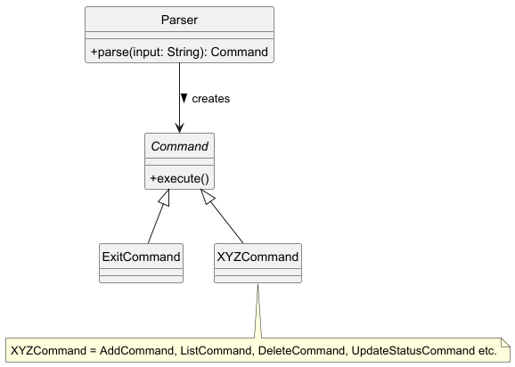
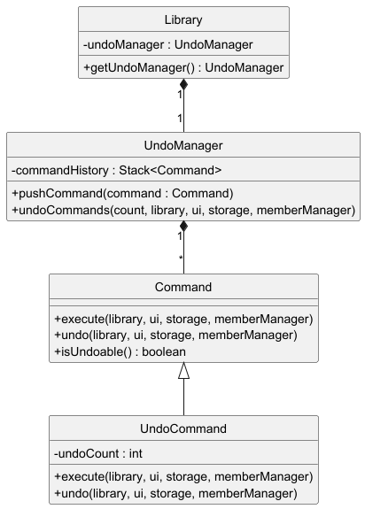
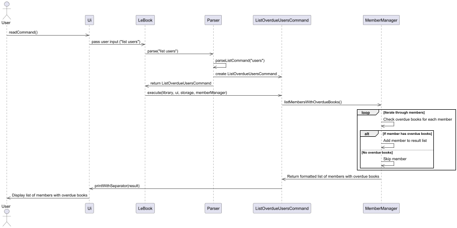
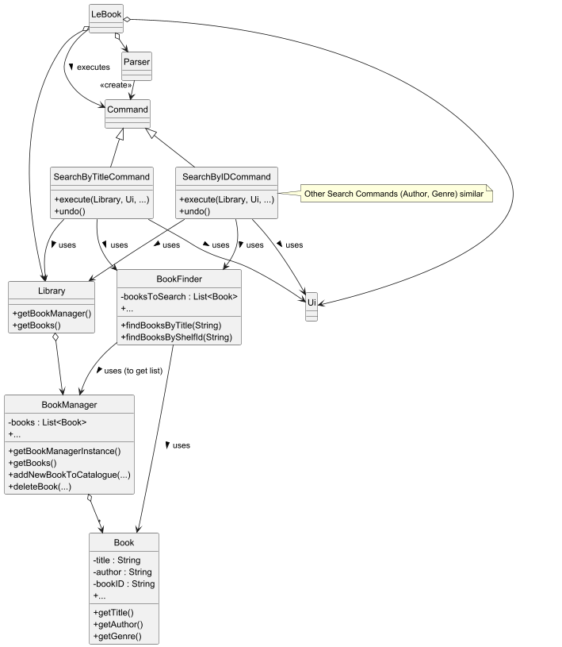
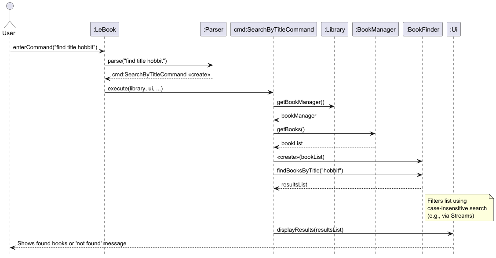
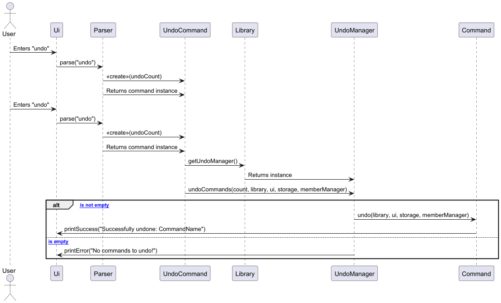

# Developer Guide

## Acknowledgements

LeBook uses the following libraries:
1. [JUnit](https://junit.org/junit5/) - For writing and executing automated tests
2. [Gradle](https://gradle.org/) - A build automation tool

## Design

### Parser component
**API:** [`Parser.java`](https://github.com/AY2425S2-CS2113-T13-3/tp/blob/master/src/main/java/seedu/duke/parser/Parser.java)

Shown below is a simplified class diagram of the `Parser` component:

The parser component is responsible for interpreting user input and calling the appropriate command object.
It takes a string input from the user, determines the corresponding command type, and returns an instance of a subclass of Command.

How the parser component works:
1. Extracts the command keyword from the user input.
2. Matches the keyword to the relevant commands.
3. Parses and extracts the remaining arguments (if any).
4. Returns a corresponding Command object for execution.

### Storage Class
**API:** [`Storage.java`](https://github.com/AY2425S2-CS2113-T13-3/tp/blob/master/src/main/java/seedu/duke/storage/Storage.java)
1. **Overview**
   - The `Storage` class in LeBook is responsible for saving the data after the user exits `LeBook`. To load the data when the user launches `LeBook`, it reads data from a file and loads it into a list. When exiting the program, it writes the Books back into the file in a specific format.
2. **Design**
   - Each `Book` is stored in structured text using a `|` delimiter.
   - Each time the user exits the program, the file is overwritten, ensuring that the content is up to date.
   - If the file to save the data does not exist, an empty list is returned. Exceptions are caught and logged.

### Command Class

**Overview**
   - All commands extend the Command class, which is abstract and defines the execute() method.
   - The execute() method in each command class contains the logic to perform a specific action.
   - Each command interacts with Library (to manage catalogue and shelves), Ui (to print messages), and Storage (to save data to a file).

## Implementation

### Add Book Feature
*(to be updated)*

### Delete Book Feature
The delete book feature allows librarians to delete irrelevant books
from the library using their bookID, their unique title and author or
their bookIndex. 

Each delete command also supports undo, restoring the last deleted book into the system.

##### Commands & Behavior
1. DeleteByIndexCommand
   - Deletes a book based on its index in the global catalog list.
   - Input: delete num/0
   - Calls library.deleteBook(index)
   - Retrieves and stores the deleted book for undo
   - Removes it from its corresponding shelf (replaces with a dummy book)

2. DeleteByBookCommand
   - Deletes a book based on the title and author
   - Input: delete bk/The Hobbit/J.R.R. Tolkien
   - Retrieves the book from the library using matching title + author
   - Deletes and stores it for undo

3. DeleteByIDCommand
   - Deletes a book based on its unique book ID, e.g. AC-0-1.
   - Input: delete id/AC-0-1
   - Retrieves by ID → deletes from catalog and updates shelf
   - Stored for undo

#### Execution Flow
Given below is an example usage scenario and how the delete mechanism behaves at each step

Assuming the initial state of the library is that there's one book titled `Book1` by `AuthorA`

Step 1. The user types in the string input `delete num/1` 
to delete the 1st book in the catalogue (in this case, it's `Book1`)

Step 2. The Parser class parses the input and creates a 
`DeleteByIndexCommand`.

Step 3. The `execute` method in this command class calls library's `deleteBook(Int bookIndex)` method

Step 4. library calls upon `catalogueManager` `deleteBook(bookIndex)` to delete the book from the 
catalogue. The response containing information about the bookDeletion is stored in `response`

Step 5. library calls retrieves the `bookID` using the `bookIndex` and passes it to `shelvesManager`
which deletes the book from the relevant shelf.

Step 6. Book deletion is complete. 
The response is finally returned back to Parser which prints out the `response`.
`Storage` is also updated.

**Sequence Diagram** (of this example)

### List Book Feature
The list book feature allows librarians to see the basic information of the 
catalogue in their system. This includes the `BookTitle`, `Author`, `BookID`
and the `DueDate` if the book was borrowed.

#### Commands & Behavior

1. ListCommand
   - List all books in the global catalogue with their respective information
   - Input: `list`
   - Calls library.listBooks() which returns the list of books in String format
   - UI prints the response
   
#### Execution Flow
Given below is an example usage scenario and how the list mechanism behaves at each step

Assuming the initial state of the library is that there's one book titled Book1 by AuthorA

Step 1. The user types in the string input `list` to list all books in the catalogue

Step 2. The Parser class parses the input and creates a ListCommand.

Step 3. The execute method in this command class calls library's `listBooks()` method

Step 4. library calls upon catalogueManager's `listBooks()` method, stores the response

Step 5. The response is returned to the command class and printed out

### List Members with Overdue Books Feature
The list members with overdue books feature allows librarians to view a list of members who currently have overdue books.
It retrieves data from the `MemberManager` class, which maintains a list of all members and their borrowed books, and 
checks the overdue status of each book.

The feature is facilitated by the following components:
- `ListOverdueUsersCommand`: A command object that encapsulates the logic for listing members with overdue books.
- `MemberManager`: Responsible for managing all members and their borrowed books.
- `Member`: Represents an individual member and provides methods to retrieve their overdue books.
- `Ui`: Displays the formatted list of members with overdue books to the librarian.

**Key Methods**
- `listMembersWithOverdueBooks()` in `MemberManager` class:
  - Iterates through all members.
  - Checks each member's borrowed books for overdue status.
  - Returns a formatted string listing members with overdue books.
- `getOverdueBooks()` in `Member` class:
  - Returns a list of overdue books for a specific member.

**Execution Flow**
1. The librarian enters a string input `list users`.
2. The `Parser` class parses the input and creates a `ListOverdueUsersCommand`.
3. The `execute` method in `ListOverdueUsersCommand` class calls MemberManager's `listMembersWithOverdueBooks()` method.
4. The `MemberManager` iterates through its list of members, checks for overdue books, and builds a formatted string containing the results.
5. The result is passed to the `Ui`, which displays it to the user.

**Sequence Diagram**

### Catalogue Management (BookManager)
The `BookManager` class acts as the central repository for the logical catalogue of books. 
It is implemented as a Singleton to ensure a single source of truth for the book data throughout the application's lifecycle.

Internally, `BookManager` maintains a `private static List<Book> books`. 
This list holds all individual copies of books present in the library, including duplicates if multiple copies of the same title/author exist.
It handles core operations like adding new book entries (`addNewBookToCatalogue`), deleting books by index (`deleteBook(int)`), listing all entries (`listBooks`), updating borrowing status (`updateBookStatus`), and providing library statistics (`getStatistics`).

When adding a book, `BookManager` receives a `bookID` (generated by the `ShelvesManager`) which links the logical entry to its physical shelf location.
Methods like `getUniqueTitleSize()` and `getUniqueTitles()` utilize HashSet internally to efficiently derive statistics about unique titles from the main list containing all copies.

### Searching Logic (BookFinder and Search...Command)
The search functionality is encapsulated within the BookFinder utility class and initiated by specific SearchBy...Command objects (`SearchByTitleCommand`, `SearchByAuthorCommand`, `SearchByGenreCommand`, `SearchByIDCommand`).
Delegation: Search logic is intentionally separated from `BookManager` into `BookFinder`. This promotes Separation of Concerns, making `BookManager` focused on catalogue management and `BookFinder` specialized in searching.

Workflow:
1. The user enters a find command (e.g., find title Lord of the Rings or find id AD-0-0).
2. The Parser interprets this and creates the appropriate SearchBy...Command object (e.g., `SearchByTitleCommand` with the search term).
3. During execution (execute method), the SearchCommand:
4. Retrieves the `BookManager` instance via the `Library`.
5. Gets the current `List<Book>` from `BookManager`.
6. Creates a new `BookFinder` instance, passing the `bookList` to its constructor.
7. Calls the relevant search method on the `BookFinder` instance (e.g., `finder.findBooksByTitle(searchTerm)` or `finder.findBooksByShelfId(searchTerm)`).
8. BookFinder iterates through the provided bookList (using Java Streams and filtering) to find matching books. Searches are generally case-insensitive for user-friendliness.
9. The SearchCommand receives the list of results from `BookFinder`.
10. It then uses the Ui component to display the findings or a "not found" message to the user.

BookFinder provides specific methods for each search criterion (`findBooksByTitle`, `findBooksByAuthor`, `findBooksByGenre`, `findBooksByShelfId`). The user interacts with these via the find command using criteria: title, author, genre, or id.

Shown below is a simplified class diagram of the Catalogue Management component:

Simplified Sequence Diagram `SearchByTitleCommand`: This diagram illustrates the typical flow when a user performs a title search. (This remains unchanged as the core search flow is the same).

Design considerations:

Separate `BookFinder` class. (Current Choice)
1. Pros: Adheres to the Single Responsibility Principle. `BookManager` stays focused on catalogue state, while `BookFinder` handles search algorithms. `BookFinder` can be tested independently. Easy to add new search types without modifying `BookManager`.

2. Cons: Requires passing the book list reference from `BookManager` to `BookFinder` upon creation. Introduces a small amount of indirection.

Implement search methods directly in `BookManager`
1. Pros: Reduces the number of classes. Search methods have direct access to the internal books list.

2. Cons: Bloats the `BookManager` class, mixing management and query responsibilities. Makes `BookManager` harder to test and potentially violates SRP.

### Undo Feature
The Undo feature allows users to revert the effects of previous commands that modified the library's state (`add`, `delete`, `borrow`, `return`).
It retrieves the command history from the `UndoManager` class which maintains a stack of executed commands and calls `undo()` method of the most recent undoable command.

The feature is facilitated by the following components:
- UndoCommand: Command object encapsulating logic for performing undo operation.
- UndoManager: Responsible for storing and managing history of executed commands.
- Command: Abstract class that defines `undo()` method of all commands.
- Ui: Displays `SUCCESS` or `ERROR` messages after an undo operation is made.

**Key Methods**
- `undoCommands()` in UndoManager class:
   - Pops and undoes the specified number of undoable commands from the history stack.
   - Displays error message in the event there are no undoable commands.
- `undo()` in Command class:
   - Reverts changes made by command.
   - Implemented by undoable commands, empty for non-undoable commands.

**Execution Flow**
1. User inputs string input `undo`.
2. Parser class parses input and creates UndoCommand instance.
3. Execute method in UndoCommand calls `Library`'s `getUndoManager() method.
4. UndoManager invokes `undoCommands()` and checks command history.
5. `undo()` method called for each undoable command to revert operation.
6. Ui displays success message if command was undone successfully or error message if no commands to undo.

**Sequence Diagram**

## Appendix
### Product scope

LeBook is a comprehensive library management system that allows librarians to easily catalogue borrowed and returned 
books, streamlining inventory management and tracking book availabilities.

### Target user profile

Library staff who wish to efficiently manage book collections

### Value proposition

Enables efficient cataloging, borrowing, and returning of books through a command-line interface, allowing librarians 
to manage inventory and track book availability quickly compared to a typical mouse/GUI driven app

## User Stories

| Version | As a ...  | I want to ...                                 | So that I can ...                                                                                         |
|---------|-----------|-----------------------------------------------|-----------------------------------------------------------------------------------------------------------|
| v1.0    | librarian | add new books to the system                   | keep track of the new arrivals.                                                                           |
| v1.0    | librarian | delete a book                                 | remove outdated or lost books.                                                                            |
| v1.0    | librarian | see the list of all my books                  | see what books I have in the library.                                                                     |
| v1.0    | librarian | record when members borrow a book             | keep track when a book is borrowed.                                                                       |
| v1.0    | librarian | record when members return a book             | update its availability.                                                                                  |
| v1.0    | librarian | set due dates for my books                    | so that I can monitor when books will be returned and keep track of books that have yet to been returned. |
| v1.0    | librarian | save the book details                         | keep track of book statuses when using the system again.                                                  |
| v1.0    | librarian | enter the command as one long string          | enter the input without caring about different parts of the input.                                        |
| v1.0    | librarian | see what happens whenever I perform a command | confirm that my inputs have been added correctly.                                                         |
| v2.0    | librarian | view the list of all available commands       | know what commands are available in the system.                                                           |
| v2.0    | librarian | know the genre of a book                      | better organise the catalogue.                                                                            |
| v2.0    | librarian | keep track of what shelf a book is on         | easily locate the book.                                                                                   |
| v2.0    | librarian | view the catalogue of a specific shelf        | view available/missing/borrowed books on the shelf.                                                       |
| v2.0    | librarian | view a list of overdue books                  | follow up with contacting the appropriate member.                                                         |
| v2.0    | librarian | search for a book through keywords            | find the appropriate book.                                                                                |
| v2.0    | librarian | see the overall statistics of the library     | know the total number of books, overdue books and borrowed books.                                         |
| v2.0    | librarian | undo the last command                         | correct my actions if it was a wrong commnd                                                               |

## Non-Functional Requirements

1. Should work on any mainstream OS that has installed Java 17 or above.
2. Built to support only a single user.

## Glossary

* *Member* - A person who visits the library to borrow or return a book(s).

## Instructions for manual testing

### Initial Launch

1. Download the LeBook JAR file and copy it into an empty folder.
2. Start the application by using java -jar LeBook.jar in the terminal.

### Adding a book
Adding a book while the library is empty

1. Prerequisites: List all books using the `list` command. No books in the list.
2. Test case: `add The Great Gatsby / F. Scott Fitzgerald / romance`
   - Expected: Book is added to the library and the relevant shelf. Details of the added book shown in the status message. Library now contains 1 book.
3. Test case: `add` (without title, author and genre)
   - Expected: No book is added. Error details shown in the status message. Library remains empty.
4. Other incorrect add commands to try:
   - `add TITLE`
   - `add / AUTHOR`
   - `add TITLE / AUTHOR` (missing genre)
   - `add TITLE / AUTHOR / ` (missing genre value)
   - Expected: Similar to previous.

### Deleting a book
Deleting a book while multiple books are listed

1. Prerequisites: List all books using the `list` command. Multiple books in the list.
2. Test case: `delete num/ 1`
   - Expected: First book is deleted from the list. Details of the deleted book shown in the status message. Library now contains fewer books.
3. Test case: `delete num/ 0`
   - Expected: No book is deleted. Error details shown in the status message. Library remains unchanged.
4. Test case: `delete bk/ Harry Potter / J.K. Rowling` (assuming this book does not exist in the library)
   - Expected: No book is deleted. Message shows that no such book is found.
5. Test case: `delete id/R-0-0` (assuming there's a book with this bookID)
   - Expected: Book is deleted from the list. Details of the deleted book shown in the status message. Library now contains fewer books.
6. Other incorrect delete commands to try:
   - `delete`
   - `delete bk/ ` (missing title)
   - `delete bk/ TITLE` (missing author)

### Listing books
Listing books when the library is empty and when it contains multiple books

1. Prerequisites: List all books using the `list` command. Initially, no books in the list.
2. Test case: `list` (with no books)
   - Expected: Message indicating that the library is empty.
3. Test case: `list` (after adding multiple books)
   - Expected: List displays all books with their status and details.

### Borrowing a book
Borrowing a book when it is available

1. Prerequisites: List all books using the `list` command. At least one available book in the list.
2. Test case: `borrow 1 / Alice`
   - Expected: Book is marked as borrowed. Status message indicates that the book has been borrowed. Book status changes to `[X]`.
   - Return due date is set to 2 weeks from the date of borrowing.
3. Test case: `borrow 0 / Alice`
   - Expected: No book is borrowed. Error details shown in the status message. Book status remains unchanged.
4. Other incorrect borrow commands to try:
   - `borrow`
   - `borrow 1 / ` (missing borrower name)
   - Expected: Similar to previous.

### Returning a book
Returning a borrowed book

1. Prerequisites: List all books using the `list` command. At least one borrowed book in the list.
2. Test case: `return 1`
   - Expected: Book is marked as returned. Status message indicates that the book has been returned. Book status changes to `[ ]`.
   - Return due date is reset and set to `null`.
3. Test case: `return 0`
   - Expected: No book is returned. Error details shown in the status message. Book status remains unchanged.
4. Other incorrect return commands to try: 
   - `return`
   - `return x` (where x is larger than the list size or the book is not borrowed)
   - Expected: Similar to previous.

### Listing overdue books
Listing books whose return due date has been surpassed by the current date

1. Prerequisites: List all overdue books using the `list overdue` command. Initially, no books are overdue.
2. Test case: `list overdue` (with no overdue books)
   - Expected: Message indicating that there are currently no overdue books.
3. Test case: `list overdue` (after multiple books have surpassed overdue date)
   - Expected: List displays all overdue books with their status and details.

### Listing borrowed books
Listing books that are currently borrowed

1. Prerequisites: List all borrowed books using the `list borrowed` command. Initially, no books are borrowed.
2. Test case: `list borrowed` (with no borrowed books)
   - Expected: Message indicating that there are currently no borrowed books.
3. Test case: `list borrowed` (after multiple books have been borrowed)
   - Expected: List displays all borrowed books with their status and details.

### Listing members with overdue books
Listing members who have overdue books, where the book title and author are also displayed

1. Prerequisites: List all members with overdue books using the `list users` command. Initially, no members have overdue books.
2. Test case: `list users` (with no members having overdue books)
   - Expected: Message indicating that there are currently no members with overdue books.
3. Test case: `list users` (after multiple members have overdue books)
   - Expected: List displays all members with overdue books.

### Searching books
Searching books by various criteria (title, author, genre, bookID)

1. Test case: `find title lord`
   - Expected: List displays books with titles containing "lord".
2. Test case: `find author Tolkien`
   - Expected: List displays books by authors containing "Tolkien". 
3. Test case: `find genre adventure`
   - Expected: List displays books with the genre "adventure".
4. Test case: `find id AD-0-0`
   - Expected: List displays the book with the specified ID.
5. Other incorrect find commands to try:
   - `find`
   - `find title` (missing term)
   - `find genre` (missing term)
   - Expected: Similar to previous.

### Viewing book quantity
Viewing the quantity of a specific book

1. Test case: `quantity / Harry Potter / J.K. Rowling`
   - Expected: Displays the quantity of the specified book.
2. Test case: `quantity / ` (missing title and author)
   - Expected: Error details shown in the status message.
3. Other incorrect quantity commands to try:
   - `quantity`
   - `quantity / TITLE ` (missing author)
   - Expected: Similar to previous.

### Listing books on a shelf
Listing books on a specific shelf

1. Test case: `shelf romance / 1`
   - Expected: List displays books on the specified shelf.
2. Test case: `shelf ` (missing genre and shelf number)
   - Expected: Error details shown in the status message.
3. Other incorrect shelf commands to try:
   - `shelf GENRE`
   - `shelf / SHELF_NUMBER`
   - Expected: Similar to previous.

### Viewing library statistics
Viewing the total number of book copies, unique titles, borrowed and overdue books, as well as the list of unique book titles

1. Test case: `statistics`
   - Expected: Displays library statistics.

### Undo last valid command
Undoing the last command

1. Prerequisites: There was a command executed previously.
2. Test case: `undo` (when the previous command was add, delete, borrow, return)
   - Expected: Last command is undone. Library state reverts to before the last command.
3. Test case: `undo` (other commands)
   - Expected: No command is undone. Error details shown in the status message.

### Exiting the application
Exiting the application

1. Prerequisites: Application is running.
2. Test case: `exit`
   - Expected: Application closes with a goodbye message.

### User Interface Class

1. Introduction
   The `Ui` class in LeBook handles all interactions with the user. It is responsible for reading inputs and printing outputs including welcome messages, command results and error messages.
   This class abstracts all system input/output logic to maintain separation of concerns in application.

2. Design and Implementation
   `Ui` class encapsulates a `Scanner` object to read inputs from `System.in`
   The `readCommand()` method prompts users for inputs and returns trimmed string for parsing.
   All output messages are standardized using `printWithSeparator(String message)`, which adds visual separators `=====` above and below messages for better readability.

3. Future enhancements
   Potentially add support for multi-lined inputs

### Handling missing/corrupted data files

To simulate a missing or corrupted data file:
1. Delete or rename the data file used by LeBook.
2. Run LeBook and attempt to perform operations.

Expected behavior:
- LeBook should handle the absence or corruption of the data file gracefully.
- It should either create a new data file or display an error message indicating the problem.

### Additional test cases

- **Invalid commands**: Test various invalid commands (e.g., `borrow`, `return`, `delete` without specifying a book number) to ensure that the application responds correctly with error messages.
- **Edge cases**: Test edge cases such as deleting books when the library is empty, borrowing or returning books that are not available or already borrowed, etc.